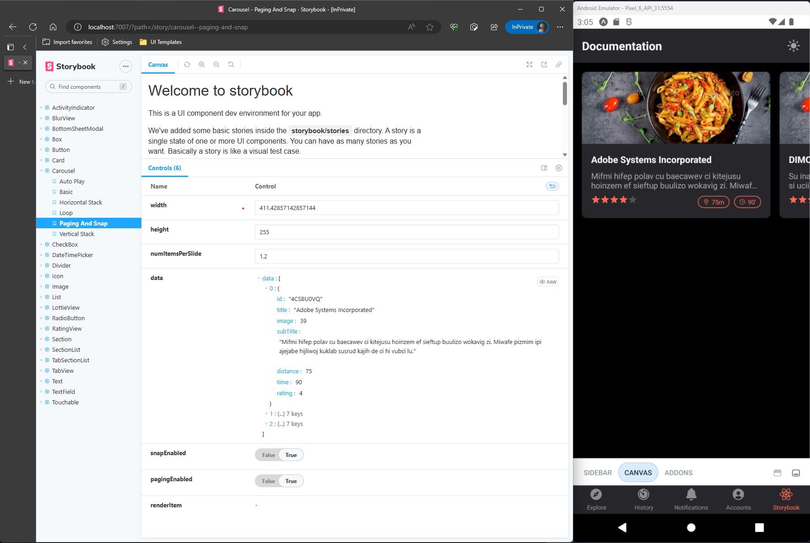

Firstly, inside your React Native project folder, you need to run this command to install all the required dependencies:
```sh
yarn install
```

Expo Go allows you to run your React Native app on a physical device without installing iOS and Android native SDKs. If you want to run your app on the iOS Simulator or an Android Virtual Device, please refer to the instructions for [React Native CLI Quickstart](https://reactnative.dev/docs/environment-setup?guide=native) to learn how to install Xcode or set up your Android development environment.

### Start the native development server
To start the development server, run the following command
```sh
yarn start
```
Or you can also  launch your app on an Android Virtual Device
```sh
yarn start:android
```

or on the iOS Simulator by running (macOS only)
```sh
yarn start:ios
```

Now you should find the the Food Star app running on a simulator

### Start the Storybook server
Storybook is a development environment for UI components. It allows you to browse a component library, view the different states of each component, and interactively develop and test components.

```sh
yarn start:storybook-server
```

Then open your browser and go to http://localhost:7007, it will give you the following screen:


:::note
Please note that you need to start the native app first before stating the story book server.

If you find that the left-pane of storybook is loading for too long, try to reload the app so that the storybook server can connect to an iOS or Android emulator.